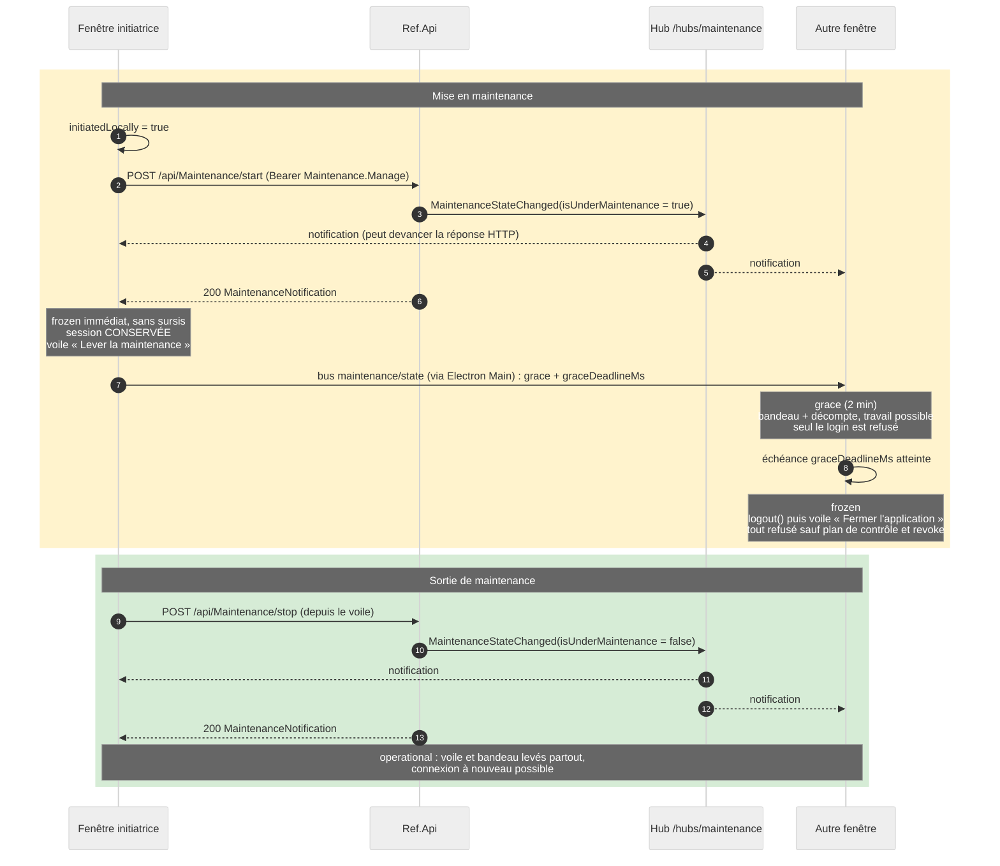

# Mode maintenance

Quand **Ref.Api** passe en maintenance, l'application accorde à l'utilisateur un
**sursis de deux minutes** pour enregistrer son travail, puis se fige : plus
aucune opération n'est possible, la session est fermée et personne ne peut se
connecter. Le client réagit à un état diffusé par l'API ; il n'a aucune
initiative propre en dehors de l'action d'exploitation des Paramètres.

> ⚠️ **Le gel est côté client.** L'API notifie l'état de maintenance mais ne
> renvoie **aucun 503** : elle n'a pas de middleware de blocage. Un client
> modifié ou un appel direct à l'API continue donc d'écrire pendant la
> maintenance. Le vrai verrou serait un middleware côté `Ref.Api`.

## Les trois phases

| Phase | Interface | Réseau | Session |
|---|---|---|---|
| `operational` | normale | libre | normale |
| `grace` | utilisable, **bandeau déplaçable avec décompte** | libre **sauf la connexion** | conservée |
| `frozen` | **voile bloquant** + bouton « Fermer l'application » | tout refusé sauf le plan de contrôle | fermée |

`GRACE_PERIOD_MS` (`maintenance-state.ts`) fixe le sursis à deux minutes. Le
sursis n'est ouvert qu'à la **transition** : une mise à jour du message ou du
délai en cours de maintenance ne le redémarre pas.

**Deux exceptions, où il n'y a rien à enregistrer** — le gel est alors immédiat,
sans bandeau :

1. la maintenance est **déjà active** au démarrage de l'application ;
2. la fenêtre **déclenche** la maintenance depuis les Paramètres : l'opérateur
   choisit l'instant. Les autres fenêtres reçoivent malgré tout le sursis, c'est
   le travail de leurs utilisateurs qu'il protège.

L'exception 2 tient quel que soit le canal qui annonce la bascule en premier :
le serveur diffuse la notification au hub **avant** de répondre au `POST start`,
et une fenêtre voisine peut rediffuser son sursis sur le bus pendant ce même
intervalle. `initiatedLocally` étant posé avant l'appel, ces deux chemins
convertissent l'annonce en gel direct — sans cette garde, la fenêtre initiatrice
affichait fugacement le bandeau de sursis.

## Contrat API (camelCase)

| Endpoint | Accès | Corps | Réponse |
|---|---|---|---|
| `GET /api/Maintenance` | **anonyme** | — | `MaintenanceNotification` (état courant) |
| `POST /api/Maintenance/start` | `Maintenance.Manage` | `{ delayMinutes?, message? }` | `MaintenanceNotification` |
| `POST /api/Maintenance/stop` | `Maintenance.Manage` | — | `MaintenanceNotification` |

Le contrôleur porte `[HasPermission(Permissions.Maintenance.Manage)]` au niveau
classe — tout endpoint ajouté ensuite est protégé par défaut — et la lecture
d'état s'en exempte explicitement (`[AllowAnonymous]`). Cette exemption est
**structurante côté client** : sans elle, une fenêtre déconnectée par le gel ne
pourrait plus apprendre la fin de la maintenance et resterait figée
indéfiniment. Le hub est anonyme pour la même raison.

Hub SignalR **`/hubs/maintenance`**, unidirectionnel : méthode serveur → client
`MaintenanceStateChanged(notification)`. À la connexion, le hub rejoue l'état
**uniquement si la maintenance est active** — d'où le `GET` d'amorçage, qui
couvre les deux cas.

`MaintenanceNotification` : `isUnderMaintenance` (bool), `delayMinutes` (int,
défaut 5 côté API), `message` (texte français directement affichable),
`timestampUtc`.

L'état est stocké **en mémoire dans le processus API** (singleton) : il est
perdu au redémarrage de l'API et n'est pas partagé entre plusieurs instances.

## Architecture côté client

```text
core/maintenance/
├── maintenance.dto.ts            contrats /api/Maintenance + hub
├── maintenance-state.ts          MaintenancePhase, MaintenanceNotice, MaintenanceState, GRACE_PERIOD_MS
├── maintenance.mapper.ts         gardes : parseMaintenanceNotification (serveur), parseSyncedMaintenanceState (bus)
├── maintenance-api.ts            appels HTTP bruts (endpoints anonymes)
├── maintenance-hub.client.ts     façade SignalR (import dynamique, reconnexion auto)
├── maintenance.service.ts        autorité : phases, sursis, décompte, gel, commandes admin
└── maintenance.interceptor.ts    refus local des requêtes API une fois figé
shared/components/maintenance-banner/    bandeau du sursis (non bloquant)
shared/components/maintenance-overlay/   voile du gel (non écartable)
```

Trois sources alimentent l'état, **toutes non fiables** :

1. `GET /api/Maintenance` à l'amorçage — source autoritaire au démarrage ;
2. le hub SignalR — temps réel ;
3. le bus inter-fenêtres (sujet `maintenance/state`) — une fenêtre dont le hub a
   échoué reste alignée sur ses voisines.

Deux gardes distinctes, car les payloads diffèrent :

- `parseMaintenanceNotification` valide les notifications du **serveur**.
  Stricte sur le champ porteur de sens (`isUnderMaintenance` doit être un
  booléen, sinon rejet), tolérante sur l'affichage : un message ou un délai
  malformé ne doit jamais empêcher le gel.
- `parseSyncedMaintenanceState` valide l'état venu du **bus**, qui porte en plus
  la phase et l'échéance du sursis. Un état `grace` sans échéance est ramené à
  `frozen` : en cas de doute pendant une maintenance, on gèle.

### Une échéance partagée entre fenêtres

`graceDeadlineMs` (epoch ms) est **publié sur le bus**, pas recalculé par chaque
fenêtre : sans cela les fenêtres gèleraient à des instants différents, et une
fenêtre ouverte au milieu du sursis s'accorderait deux minutes de plus. Chaque
fenêtre décompte de son côté et gèle à la même échéance ; une fenêtre qui
rattrape une échéance déjà passée gèle immédiatement.

Deux règles de publication méritent attention, car elles s'écartent du réflexe
« je publie ce que j'ai » :

- **Ce qui est diffusé à la transition est toujours le sursis**, même quand la
  fenêtre gèle sans attendre (cas de l'opérateur). C'est le seul endroit du
  service où l'état publié diffère de l'état local. Publier `frozen` figerait
  instantanément toutes les autres fenêtres et annulerait leur sursis.
- **L'amorçage ne publie rien.** Au démarrage la fenêtre *apprend* l'état, elle
  ne l'annonce pas. Publier alors écraserait le sursis d'une fenêtre voisine si
  la réponse HTTP devançait le rattrapage du bus. Les lectures ultérieures
  (sondage, reconnexion du hub) publient, elles : la fenêtre peut être la seule
  à savoir.

### Transport et repli

`@microsoft/signalr` est chargé en **import dynamique** : la bibliothèque reste
hors du bundle initial (budget de 500 kB respecté). Le repli par sondage
(`GET /api/Maintenance` toutes les 30 s) est armé uniquement quand le hub n'est
pas connecté — échec initial, `onreconnecting`, `onclose` — et désarmé dès la
reconnexion, qui déclenche une relecture (l'état a pu changer pendant la
coupure). Chaque tick tente aussi de relancer le hub pour revenir au temps réel.

Pas d'enveloppe RxJS ici : SignalR gère lui-même retry et négociation de
transport. Dérogation assumée au « RxJS pour le temps réel » du CLAUDE.md.

### Séquence

Vue d'ensemble des deux flux, sur le cas le plus riche (déclenchement par
l'opérateur depuis les Paramètres) :



Variante : si la maintenance est déclenchée par un **tiers** (Swagger, script
d'exploitation), aucune fenêtre n'est initiatrice — toutes suivent le chemin de
la « fenêtre B » (sursis puis gel et déconnexion), et la sortie ne peut venir
que du tiers. Si le hub d'une fenêtre est coupé, le sondage `GET` ou le bus
inter-fenêtres la rattrape (cf. « Transport et repli »).

À l'annonce (transition vers `grace`) :

1. la phase et l'échéance sont posées → **le bandeau apparaît**, l'application
   reste pleinement utilisable ;
2. l'état est publié sur `maintenance/state` (jamais republié quand il *vient* du
   bus : anti ping-pong) ;
3. un minuteur d'une seconde alimente le décompte affiché.

À l'échéance (transition vers `frozen`) :

1. la phase passe à `frozen` → **le voile se rend immédiatement** ;
2. `AuthService.logout()` purge la session, ce qui se propage à toutes les
   fenêtres par le sujet `auth/state` et détruit le shell ;
3. l'état est publié pour que l'état retenu par Electron Main reste exact (les
   rediffusions redondantes des N fenêtres sont absorbées par
   `isSameMaintenanceState`).

Bandeau et voile sont rendus par `App` **en dehors de la garde
d'authentification** : la déconnexion fait disparaître le shell, et le voile doit
continuer à couvrir l'écran de connexion pour interdire toute reconnexion.

### Ce qui est bloqué, et quand

| Couche | Pendant le sursis | Une fois figé |
|---|---|---|
| `maintenance-banner` | décompte, non bloquant, déplaçable | remplacé par le voile |
| `maintenance-overlay` | — | pointeur (fond opaque plein écran) et focus : `role="alertdialog"` + `aria-modal`, focus déplacé dans le voile puis **retenu** — sinon la tabulation atteindrait encore le formulaire de connexion resté monté derrière |
| `Shell.onKeydown` | actif (l'utilisateur travaille) | inerte ; l'écouteur est sur `document`, donc hors de portée du piège de focus |
| `maintenanceInterceptor` | tout passe **sauf** `/api/auth/login` | toute requête API échoue en 503 local, sans partir |
| `LoginPage.onSubmit` | refusé | refusé |

Le renouvellement de jeton (`/api/auth/refresh`) reste autorisé pendant le
sursis — sans lui, un enregistrement tardif échouerait en 401 — **et reste
autorisé même figée à la fenêtre initiatrice**, dont la session doit survivre
assez longtemps pour lever la maintenance. La connexion, elle, est refusée à
tout le monde dès l'annonce.

### Le bandeau du sursis

Affiché **au centre de la fenêtre** pour être vu, et **déplaçable** puisqu'il
peut masquer précisément ce qu'il faut enregistrer : à la souris via CDK Drag and
Drop, ou au clavier depuis sa poignée (flèches, `Maj` pour un grand pas, `Origine`
pour recentrer) — l'alternative clavier exigée par le CLAUDE.md pour tout
drag-and-drop.

Deux détails de mise en œuvre non évidents :

- le centrage est assuré par la **couche d'accueil** (`place-items: center`) et
  non par `transform: translate(-50%, -50%)` : le CDK pilote lui-même `transform`
  et l'écraserait, faisant sauter le bandeau d'une demi-hauteur au premier
  glisser. Corollaire agréable : le décalage étant exprimé *relativement au
  centre*, le bornage se réduit à ± la moitié de l'espace libre ;
- cette couche couvre toute la fenêtre (pour centrer et servir de limite de
  glissement) mais porte `pointer-events: none`, seul le bandeau valant `auto` :
  l'application reste pleinement cliquable pendant le sursis.

`maintenanceInterceptor` est enregistré **avant** `authInterceptor` dans
`app.config.ts`, pour court-circuiter avant toute pose de Bearer ou tentative de
renouvellement. Le 503 de synthèse porte un corps `ProblemDetails` : les écrans
métier affichent le message du serveur via `extractApiErrorMessage` sans qu'aucun
d'eux ait à connaître la maintenance.

Restent toujours joignables, même figé :

- `/api/Maintenance*` — plan de contrôle. Sans lui l'application ne pourrait
  jamais apprendre la fin de la maintenance, ni la lever. `start`/`stop`
  exigeant un Bearer, `authInterceptor` le pose ensuite normalement (il n'exclut
  que `/api/auth/`). Ce test est fait **avant** l'injection de
  `MaintenanceService` dans l'intercepteur : le `GET` d'amorçage émis par le
  service lui-même provoquerait sinon une dépendance circulaire côté DI
  (l'amorçage est également différé d'une microtâche pour la même raison).
- `/api/auth/revoke` — la déconnexion forcée doit pouvoir révoquer le refresh
  token.

### Le voile du gel

Outre le message serveur et la durée estimée, le voile affiche la **fin
prévisionnelle** de la maintenance : horodatage serveur de la bascule
(`timestampUtc`) + `delayMinutes`, rendue dans le fuseau local
(`Intl.DateTimeFormat('fr-FR')`). Elle est masquée si la durée est inconnue
(`delayMinutes` = 0) ou l'horodatage inexploitable — mieux vaut aucune heure
qu'une heure fausse. C'est une estimation d'affichage : la levée réelle reste
pilotée par `stop`, jamais par cette échéance.

### Fermer l'application

Le voile propose « Fermer l'application », câblé sur le canal IPC **`app:quit`**
(`electron/main.cjs`), à distinguer de `window:close` qui ne ferme que la fenêtre
appelante. La fermeture est **inconditionnelle** : pas de garde de modifications
non enregistrées, puisque le sursis a déjà laissé le temps d'enregistrer et que
le dialogue de confirmation (z-index 1000) serait de toute façon masqué par le
voile (2000).

## Déclencher la maintenance depuis l'application

**Paramètres → Maintenance** : durée estimée, message optionnel, bouton
« Passer en maintenance ».

**La fenêtre initiatrice est figée immédiatement** — elle choisit l'instant, donc
elle n'a rien à enregistrer : le voile s'affiche dès la réponse de l'API.
L'avertissement de l'écran le dit avant validation. Les autres fenêtres, elles,
reçoivent le sursis.

Elle est ensuite traitée à part de bout en bout, parce qu'elle est le seul moyen
de remettre l'application en service — `stop` exigeant `Maintenance.Manage`,
tout ce qui lui retirerait sa session la verrouillerait dehors :

| | Fenêtre initiatrice | Autres fenêtres |
|---|---|---|
| Sursis | non, gel immédiat | oui, deux minutes |
| Session | **conservée** (`refresh` autorisé même figée) | fermée au gel |
| Voile | « Lever la maintenance » | « Fermer l'application » |

La distinction repose sur `MaintenanceService.initiatedLocally`, signal local
jamais publié ni persisté.

> `initiatedLocally` est un repère d'**ergonomie**, pas une frontière de
> sécurité : celle-ci est côté API, qui exige `Maintenance.Manage`.

## Tests

Specs Vitest (`ng test --include '**/maintenance*.spec.ts'`) :

- `maintenance.mapper.spec.ts` — payloads hostiles ou incomplets, normalisation
  du délai, phase et échéance du payload de bus, `grace` sans échéance → `frozen` ;
- `maintenance.service.spec.ts` — amorçage par l'API (sans publication), gel
  immédiat si la maintenance préexiste, ouverture du sursis sans déconnexion,
  décompte, gel et déconnexion unique à l'échéance, sursis non redémarré par une
  mise à jour de message, annulation si la maintenance est levée avant
  l'échéance, adoption de l'échéance reçue du bus, non-republication de l'état
  venu du bus, gel immédiat **et session conservée** pour la fenêtre initiatrice
  qui diffuse malgré tout le sursis — y compris quand la notification du hub
  double la réponse HTTP ou qu'une voisine rediffuse le sursis par le bus —,
  armement/désarmement du sondage ;
- `maintenance.interceptor.spec.ts` — tout passe pendant le sursis sauf le login,
  refus 503 sans émission réseau une fois figé, plan de contrôle et `revoke`
  laissés passer, `refresh` réservé à la fenêtre initiatrice une fois figée
  (mais jamais le `login`) ;
- `maintenance-banner.spec.ts` — format `m:ss`, décompte soustrait aux lecteurs
  d'écran, couche transparente au pointeur, déplacement au clavier (flèches, pas
  accéléré, recentrage) ;
- `maintenance-overlay.spec.ts` — accessibilité, rétention du focus, actions
  exclusives selon le public (fermeture pour les clients, levée seule pour la
  fenêtre initiatrice) et message de session correspondant, fin prévisionnelle
  (calcul indépendant du fuseau du poste de test, masquée si durée ou
  horodatage inexploitables) ;
- `settings-page.spec.ts` — avertissement affiché, délai et message transmis,
  repli sur le délai par défaut, erreur d'API affichée ;
- `app.spec.ts` — bandeau pendant le sursis sans figer ni déconnecter, voile
  au-dessus de l'écran de connexion, fermeture de la session au gel.

`src/test-setup.ts` (déclaré dans `angular.json`, cible `test`) comble
`scrollIntoView`/`scrollBy`, absents de l'environnement de test mais présents
dans Chromium : sans cela tout test montant le shell échoue sur une erreur non
gérée alors que le code est correct en production.

### Vérification bout en bout (dev)

À faire sous `ng serve` / `npm run electron:dev` : c'est le seul mode où le CORS
de Ref.Api autorise l'origine du renderer.

1. démarrer Ref.Api puis `npm run electron:dev`, se connecter, ouvrir un onglet
   et en détacher un dans une seconde fenêtre ;
2. saisir une modification **sans enregistrer** dans un écran métier ;
3. déclencher la maintenance depuis un **tiers** (Swagger, ou la commande
   ci-dessous), afin d'observer le sursis dans les deux fenêtres — depuis les
   Paramètres, la fenêtre initiatrice gèlerait aussitôt. `start` et `stop`
   exigeant `Maintenance.Manage`, un Bearer est nécessaire :

   ```powershell
   $auth = Invoke-RestMethod -Method Post http://localhost:5064/api/auth/login `
     -ContentType application/json -Body '{"email":"...","password":"..."}'
   $h = @{ Authorization = "Bearer $($auth.accessToken)" }
   Invoke-RestMethod -Method Post http://localhost:5064/api/Maintenance/start `
     -Headers $h -ContentType application/json `
     -Body '{"delayMinutes":3,"message":"Test."}'
   ```
4. attendu : bandeau avec décompte **au centre** des deux fenêtres, application
   toujours utilisable, enregistrement possible → il doit réussir ;
5. déplacer le bandeau à la souris, puis au clavier depuis sa poignée (flèches,
   `Origine` pour recentrer) : il ne doit jamais sortir de la fenêtre ;
6. laisser filer les deux minutes : les deux fenêtres gèlent **au même instant**,
   session fermée, écran de connexion derrière le voile, raccourcis inertes ; le
   voile affiche la fin prévisionnelle (début + durée annoncée, heure locale) ;
7. tenter une connexion → refusée ;
8. `Invoke-RestMethod -Method Post http://localhost:5064/api/Maintenance/stop
   -Headers $h` → voile levé partout, connexion à nouveau possible ;
9. rejouer en déclenchant depuis **Paramètres** (avec un compte porteur de
   `Maintenance.Manage`) : la fenêtre initiatrice passe **directement au voile,
   sans jamais montrer le bandeau de sursis**, garde sa session et ne propose
   **que** « Lever la maintenance » ; la seconde fenêtre affiche le bandeau de
   sursis puis, une fois figée, ne propose que « Fermer l'application ».
   Vérifier que la levée depuis la fenêtre initiatrice fonctionne — c'est tout
   l'enjeu de la session conservée ;
10. rejouer avec un compte **sans** la permission → la demande est refusée et le
    message de l'API s'affiche sous le formulaire, sans basculer l'application ;
11. depuis une fenêtre non initiatrice figée, cliquer « Fermer l'application » →
    l'application entière se ferme, sans confirmation ;
12. lever la maintenance **pendant** le sursis → le bandeau disparaît, aucun gel
    tardif ;
13. démarrer l'application alors que la maintenance est **déjà** active → voile
    dès le boot, sans sursis ;
14. arrêter l'API pendant la maintenance puis la relancer → le sondage rétablit
    l'état sans le hub.

## Limites connues / reste à faire

- **Le sursis ne garantit pas l'enregistrement** : passé deux minutes, ce qui
  n'est pas enregistré est perdu, sans confirmation. Le gel ignore
  délibérément `WorkspaceStore.hasUnsavedChanges` — la maintenance n'est pas
  négociable. Amélioration possible : lister les onglets encore modifiés dans le
  bandeau pour guider l'utilisateur.
- **Le sursis est fixe** (deux minutes, `GRACE_PERIOD_MS`) et ne provient pas du
  serveur. `delayMinutes` de l'API décrit la durée de l'intervention, pas le
  sursis.
- **La section Maintenance des Paramètres est visible par tous** : le client
  n'exploite pas encore le claim `perm` du JWT (cf. `docs/authentification.md`).
  Un utilisateur sans `Maintenance.Manage` voit le formulaire et reçoit le refus
  de l'API à la validation, affiché par `extractApiErrorMessage`. La sécurité est
  respectée — seule l'ergonomie est perfectible.
- **Gel côté client uniquement** (cf. avertissement en tête) : l'API n'oppose
  aucun refus aux écritures pendant la maintenance.
- **Horloges locales** : l'échéance du sursis est un instant epoch produit par la
  fenêtre qui a reçu l'annonce. Toutes les fenêtres d'une même machine partagent
  l'horloge, donc gèlent ensemble ; un décalage n'apparaîtrait qu'entre postes
  différents, ce qui est sans conséquence (chaque poste gèle au plus tard deux
  minutes après l'annonce).
- **App packagée (`file://`)** : comme pour l'auth, l'origine `null` n'est pas
  dans `Cors:AllowedOrigins` de Ref.Api — ni les contrôleurs ni le hub ne
  répondront. À traiter au packaging, en ajoutant aussi l'origine WebSocket
  (`wss://`) de l'API déployée à la CSP `connect-src` de `src/index.html`.
- **Plusieurs fenêtres = plusieurs connexions au hub** (une par renderer, pas
  d'élection de meneur). Choix assumé : aucune fenêtre n'est un point de
  défaillance unique, et chaque fenêtre se répare seule. À reconsidérer si le
  nombre de fenêtres devient élevé.
- Chaque fenêtre appelle `logout()` de son côté au gel ; les `revoke`
  surnuméraires sont sans effet (204 idempotent, et la session est déjà nulle
  dans les fenêtres qui ont reçu `auth/state` en premier).
