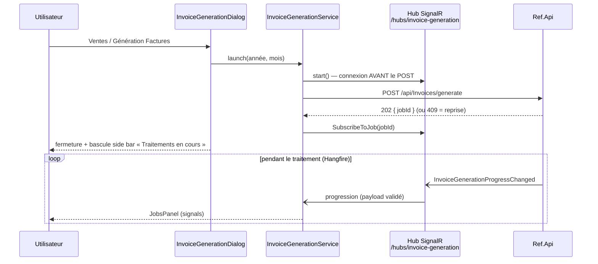

# Synthèse — Génération des factures de vente

> Vue d'ensemble de la fonctionnalité livrée en août 2026. Le détail technique
> (contrat backend complet, cycle de vie de l'abonnement SignalR) est dans
> [generation-factures.md](generation-factures.md).

## Objectif

Permettre à l'utilisateur de **lancer la génération des factures de vente
d'une période** (année/mois) depuis l'application desktop, et de **suivre la
progression du traitement backend en temps réel** sans bloquer son travail :
le job s'exécute côté serveur (Hangfire), la progression arrive par SignalR
dans un panneau dédié de la side bar.

## Parcours utilisateur

1. **Lancement** : explorateur → Modules / **Ventes** / **Génération
   Factures**. Un dialog modal s'ouvre, pré-rempli au **mois précédent**
   (cas d'usage : facturer le mois écoulé) ; l'utilisateur ajuste la période
   si besoin (mois via sélecteur, année bornée 2000..N+1) et clique
   « Lancer le traitement ».
2. **Bascule automatique** : le dialog se ferme et la side bar s'ouvre sur la
   vue **« Traitements en cours »** (nouvel item de l'activity bar, icône
   roue dentée). Une **pastille** reste visible sur l'icône tant qu'un
   traitement est actif, même si l'utilisateur navigue ailleurs.
3. **Suivi** : le panneau affiche la période, le statut (En attente de
   démarrage / Démarré / En cours / Terminé / Échec / Annulé), une barre de
   progression `x / total (%)`, le dernier message serveur horodaté.
4. **Actions** : **Annuler** pendant l'exécution (annulation coopérative,
   confirmée par le statut « Annulé » quelques secondes plus tard) ;
   **Masquer** une fois le traitement terminé.
5. **Cas particulier** : si une génération est **déjà en cours** pour la même
   période (réponse 409), ce n'est pas une erreur — le suivi **reprend** sur
   le job existant, avec un bandeau « suivi repris ».

## Architecture

- **`src/app/core/invoicing/`** (nouveau, miroir de `core/maintenance/`) :
  DTO, modèle domaine, gardes de type (payloads non fiables), `InvoicingApi`
  (HTTP), `InvoiceGenerationHubClient` (SignalR en import dynamique),
  `InvoiceGenerationService` (état en signals, autorité du suivi).
- **`src/app/shell/`** : le dialog de lancement et le panneau de suivi sont
  des composants du shell (la side bar ne peut pas dépendre d'une feature).
- **Budget bundle** : dialog et panneau rendus derrière `@defer (on
  immediate)`, SignalR chargé à la demande — `core/invoicing` reste hors du
  bundle initial (498,4 kB / 500 kB après ajout). La pastille passe par
  `ShellUiService.jobActivity` pour ne rien tirer au démarrage.

## Décisions de robustesse

| Situation | Comportement |
|---|---|
| Le job démarre dès la réponse HTTP (événement `Started` possiblement manqué) | Hub connecté **avant** le POST ; état local `pending` ; ne jamais dépendre de `Started` |
| Reconnexion SignalR (les groupes serveur sont perdus) | Réabonnement automatique au groupe du job dans `onreconnected` |
| 409 au lancement (période déjà en cours) | Reprise du suivi du job existant, signalée dans le panneau |
| `Failed` (Hangfire réessaie côté serveur) | On **reste abonné** ; statut « Échec — nouvelle tentative automatique » |
| `Completed` / `Cancelled` | Désabonnement + arrêt du hub ; résultat affiché jusqu'à « Masquer » |
| Aucun événement pendant 10 s (pas de GET de statut côté backend) | Mention « En attente de nouvelles du serveur… » sans conclure |

## Fichiers livrés

**Créés**
- `src/app/core/invoicing/` — `invoicing.dto.ts`, `invoice-generation.model.ts`,
  `invoicing.mapper.ts`, `invoicing-api.ts`, `invoice-generation-hub.client.ts`,
  `invoice-generation.service.ts` (+ specs mapper, api, service)
- `src/app/shell/invoice-generation-dialog/` — dialog de saisie (+ spec)
- `src/app/shell/side-bar/jobs-panel/` — panneau de suivi (+ spec)
- `docs/generation-factures.md` — documentation technique détaillée

**Modifiés**
- `src/app/core/shell/shell-ui.service.ts` — vue `'jobs'`, dialog, pastille
  (+ spec)
- `src/app/shell/activity-bar/` — item « Traitements en cours », roue dentée,
  pastille (+ spec)
- `src/app/shell/side-bar/` — nœud d'arbre de type `action`, entrée
  « Génération Factures » du groupe Ventes, vue `@case ('jobs')`
- `src/app/shell/shell.ts` / `.html` — rendu du dialog derrière `@defer`
- `src/app/shared/components/icon/icon.ts` — icône `invoice` (Fluent
  `receipt 20 regular`)

## Vérifications

- `npm test` : 423 tests verts (dont ~40 nouveaux sur cette fonctionnalité).
- `npm run build` : bundle initial 498,39 kB (budget 500 kB) ;
  `invoice-generation-dialog`, `jobs-panel` et SignalR en chunks différés.
- Test manuel avec Ref.Api (`http://localhost:5064`) : lancement, progression
  live, reprise 409, annulation, coupure/reprise de l'API.

## Limites (itération actuelle) et évolutions possibles

- **Suivi local à la fenêtre courante** : pas de synchronisation
  inter-fenêtres — extensible via le bus `WindowSyncService` (sujet
  `invoicing/state`).
- **Un seul job suivi à la fois** — le modèle reste extensible vers une liste
  de traitements.
- **Pas de rattrapage d'état** après rechargement (nécessiterait un
  `GET /api/Invoices/{jobId}` côté backend).
- Hub anonyme côté serveur ; si le backend le protège, prévoir
  `accessTokenFactory` côté client et `OnMessageReceived` côté API.
